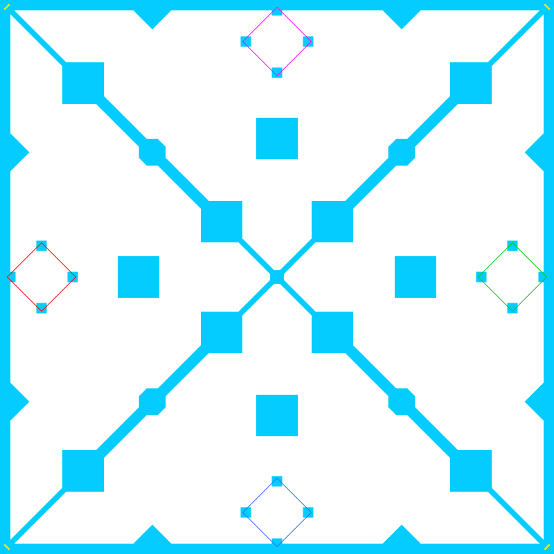
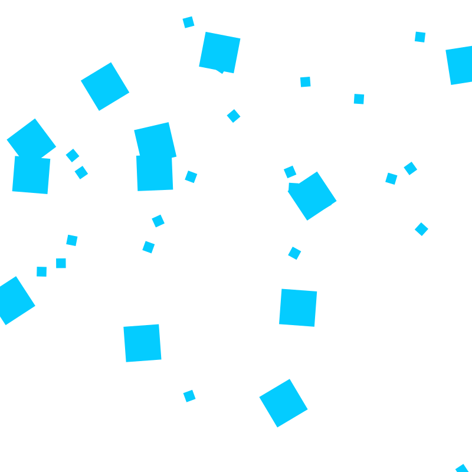

# BZFlag Rendering

[](https://packagist.org/packages/allejo/bzflag-rendering.php)
[](LICENSE.md)

A PHP 7.1+ package for drawing BZFlag related things such as map thumbnails; this is a sister project to [bzflag-networking.php](https://github.com/allejo/bzflag-networking.php).

## Installation

This package can be installed via [Composer](https://getcomposer.org).

```bash
composer require allejo/bzflag-rendering.php
```

## Usage

This library currently supports exporting maps as SVGs. Using the `WorldRenderer` class, you can give it a `WorldDatabase` instance from version 1.1+ of `bzflag-networking.php`.

```php
use allejo\bzflag\graphics\SVG\Radar\WorldRenderer;
use allejo\bzflag\replays\Replay;

$replay = new Replay('official-match.rec');
$world = $replay->getHeader()->getWorld();

$renderer = new WorldRenderer($world);

echo $renderer->exportStringSVG();
```

### Namespaces in this package

This package is dedicated to drawing and rendering BZFlag related images or files, meaning this will have dependencies for drawing. In order to allow these dependencies to be "opt-in," it is a separate package.

However, the namespace of this project is shared with its sister project. The namespaces available in this package are the following:

- `allejo\bzflag\graphics`

## Examples

Here are some examples of SVG images generated by this library.

<table>
    <tr>
        <td>
            
        </td>
        <td>
            
        </td>
    </tr>
</table>

## Obstacle Drawing Support

This project currently has support for drawing the following BZW 2.x object types.

| Object Type | Support            |
|:------------|:-------------------|
| arc         | :x:                |
| base        | :white_check_mark: |
| box         | :white_check_mark: |
| cone        | :x:                |
| mesh        | :x:                |
| pyramid     | :white_check_mark: |
| sphere      | :x:                |
| teleporter  | :white_check_mark: |
| tetra       | :x:                |

## License

[MIT](./LICENSE.md)
